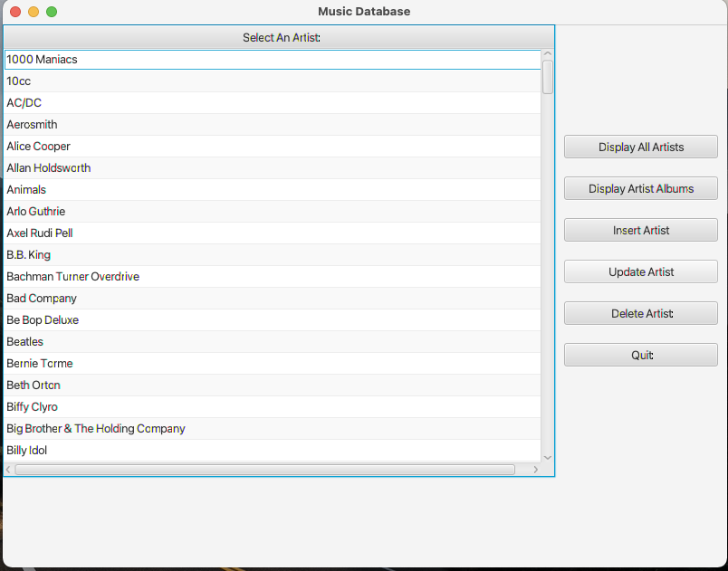

# Music PlayList JavaFX Project
Architectural Design Patten is the Model View Controller (MVC).

Implemented as a JavaFX project using SQLite.

** Common Installation Problem

1. You may need to reset the path to the database (music.db)

// private static final String CONNECTION_STRING = "jdbc:sqlite:D:\\database\\" + DB_NAME; (WINDOWS)

// private static final String CONNECTION_STRING = "jdbc:sqlite:D:/Users/database/" + DB_NAME; (Mac)

2. UI Screenshot

+ Adapted from Java Programming Master Class Covering Java 11 & 17 by Tim Buckalka (UDEMY)

URL: https://www.udemy.com/course/java-the-complete-java-developer-course/
